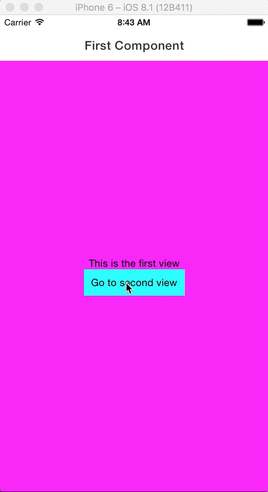

# Build Up a Cross Platform App in 10 minutes with React Native

Mobile Apps are a crucial part of our daily life.
Yet, building a native mobile app for everyone requires to have knowledge in at least two languages: Java for Android and Swift or Objective-C for iOS.
At least, that’s what I thought until I discovered **React Native**.

## What is React Native?

React Native is a framework to build native apps using only Javascript.
For the Javascript fan I am, it's a great opportunity.
React Native builds **native apps**, and not **hybrid apps** or «HTML5» apps.
This is possible because the Javascript written is transformed into native UI blocks for Android or iOS.
I suggest you check React Native's [official website](https://facebook.github.io/react-native/) for more information.
Let's jump into building of first mobile app.

## Installing React Native

The **first step** is installing React Native :)
I won't pretend explaining this better than what has already been done inthe last few months.
However, I have a few suggestions and links to share

To install the CLI tools for React Native, you'll need Node.js (Node.js 6 works fine, I haven't tested other versions but React Native should work with Node.js 4 or newer).
Then you can just run `npm install -g react-native-cli` to install React Native.

### iOS

In order to develop an iOS app, you'll need a Mac with xCode (you can find it on the AppStore).
If you are using Linux, a [great article](https://github.com/theodo/theodo-blog/blob/master/posts/2016/10/ios-development-from-linux.md) has been published to help you develop iOS app on Linux.
XCode comes up with a simulator, which we will use for development.

### Android

Testing you application on an Android device is a bit tougher.
The best practices are described on [React Native's website](https://facebook.github.io/react-native/docs/getting-started.html).
Here are the main points:

1. Install [Android Studio](https://developer.android.com/studio/install.html)

2. Set up paths
   ```bash
   export ANDROID_HOME=~/Android/Sdk
   export PATH=${PATH}:${ANDROID_HOME}/tools
   ```

3. Set up Android Virtual Device (if not set up by Android Studio)
   ```bash
   android avd
   ```

## Creating and running a React Native App

To create a React Native App run:

```bash
react-native init <YourAppNameHere>
```

Then launch it on the simulator you want with :

```bash
react-native run-ios
react-native run-android
```

You should see the following screen on your emulator:


### Modifying our app

Let's enter the fun part!
Creating our **first cross platform mobile app**!
Open you favorite editor and let's take a look at what React Native generated for us.
The whole code for this article is available [here](https://github.com/ghamaide/RN-testapp).

We have two files that represent our two entry points: one for iOS (`index.ios.js`) and one for Android (`index.android.js`).
Let's play with the `index.ios.js` and change the text and style.

```javascript
<Text style={styles.welcome}>
  Our first React Native App
</Text>
```

You can see the changes in your emulator by pressing Ctrl+R or Cmd+R thanks to some live reloading.
This makes React Native development so much easier.

#### How does the styling work in React Native?

The sample app gives us an example of how the styling works in React Native.

```javascript
const styles = StyleSheet.create({
  container: {
    flex: 1,
    justifyContent: 'center',
    alignItems: 'center',
    backgroundColor: '#F5FCFF',
  },
});
```

There are **two key points** to have in mind when developing in React Native.
1. React Native uses **flexbox** for the design.
If you've never used flexbox, here are two awesome links to master it in minutes :)
  * A [TD game](http://www.flexboxdefense.com/)
  * A greatly written [guide](https://css-tricks.com/snippets/css/a-guide-to-flexbox/)

2. React Native writes CSS styles in camel case.
  * `background-color` => `backgroundColor`
  * `border-width` => `borderWidth`

### React Native Components

You can find a list of components to use in React Native on their official website.
For our demo app, we'll use the navigation component given to us by RN : `Navigator`

Let's create a src folder where the components inside will be used by both our Android and iOS app.
Inside our src folder, let's create a components folder and inside it two JS files : `firstPage.js` and `secondPage.js`

**firstPage.js**

```javascript
import React, {Component} from 'react';
import {
  StyleSheet,
  Text,
  TouchableHighlight,
  View
} from 'react-native';

import SecondPage from './secondPage';

class FirstPage extends Component {
  static route(props) {
    return {
      id: 'FirstPage',
      component: FirstPage
    };
  }

  render() {
    return (
      <View style={styles.container}>
        <Text>This is the first view</Text>
        <TouchableHighlight onPress={() => this.props.navigator.push(SecondPage.route())}</TouchableHighlight>
      </View>
    );
  }
}

const styles = StyleSheet.create({
  container: {
    flex: 1,
    justifyContent: 'center',
    alignItems: 'center',
    backgroundColor: '#FF00FF',
  },
});

export default FirstPage;

```

**secondPage.js**

```javascript
import React, {Component} from 'react';
import {
  StyleSheet,
  Text,
  View
} from 'react-native';

class SecondPage extends Component {
  static route(props) {
    return {
      id: 'FirstPage',
      component: SecondPage
    };
  }

  render() {
    return (
      <View style={styles.container}>
        <Text>This is the second view</Text>
      </View>
    );
  }
}

const styles = StyleSheet.create({
  container: {
    flex: 1,
    justifyContent: 'center',
    alignItems: 'center',
    backgroundColor: '#FFFF00',
  },
});

export default SecondPage;
```

In the FirstPage component, our button is a `TouchableHighlight` and it has a `onPress` method that pushes the second view.
Our second page component just has a text.

We then need to set up our Navigator to go back and forth from one page to the other.
First, in our `index.ios.js`, let's remove what's in the container View and add a Navigator:

**index.ios.js**

```javascript
render() {
  return (
    <View style={styles.container}>
      <Navigator
        initialRoute={FirstPage.route()}
        renderScene={this.renderScene}
        style={styles.navigator} />
    </View>
  );
}
```

Let's analyze these lines.
1. We've given our Navigator an initial route that will be displayed when loading our app.
2. We've given a renderScene function that will render our different scenes.
We'll take a look at this function in a moment.
3. We've given a style to our Navigator

What should our `renderScene` do?
Well, it should render our component.
Let's see how to write this:

**index.ios.js**

```javascript
renderScene = (route, navigator) => {
  return React.createElement(route.component, {navigator: navigator});
}
```

Our `renderScene` method takes two arguments.
The first one is the **component** we want to mount and the second one is the navigator itself.
We'll need to pass the navigator to our components as a prop to be able to navigate back and forth.

**FirstComponent**

```javascript
static route(props) {
  return {
    id: 'FirstPage',
    component: FirstPage
  };
}
```

Let's run our app... Here is how it should look.

|                  First Screen                     |      Second Screen (after pressing the button)     |
|:-------------------------------------------------:|:--------------------------------------------------:|
|    |     |

Now, there's something missing here.
Indeed, when navigating in an app, we're expecting a **Navbar** on the top to navigate!

### Putting a Navbar

Navigator has a way of doing this.
You can pass a component written by your hands to it and it will display it as a Navbar.
However, react native being an open source project, the community has developed a lot of packages for us to use.
In [this repository](https://github.com/jondot/awesome-react-native), you'll find a non-exhaustive list of great packages.
Here, we'll be using the package [React Native Navbar](https://github.com/react-native-community/react-native-navbar).

Let's install it.

```javascript
npm i --save react-native-navbar
```

Then, let's import it in our two views.

```javascript
import NavBar from 'react-native-navbar';
```

**FirstComponent**

```javascript
render() {
  const titleConfig = {
    title: 'First Component',
  };

  return (
    <View style={styles.container}>
      <NavBar title={titleConfig} />
      <View style={styles.content}>
        <Text>This is the first view</Text>
        <TouchableHighlight onPress={() => this.props.navigator.push(SecondPage.route())} style={styles.button}>
          <Text>Go to second view</Text>
        </TouchableHighlight>
      </View>
    </View>
  );
}
```

**SecondComponent**

```javascript
render() {
  const titleConfig = {
    title: 'Second Component',
  };

  const leftButtonConfig = {
    title: 'Previous',
    handler: () => this.props.navigator.pop(),
  }

  return (
    <View style={styles.container}>
      <NavBar title={titleConfig} leftButton={leftButtonConfig} />
      <View style={styles.content}>
        <Text>This is the second view</Text>
      </View>
    </View>
  );
}
```

In order for our components to render as we expect them to, we need to change a bit our components' styles.

```javascript
container: {
  flex: 1
},
content: {
  flex: 1,
  backgroundColor: '#FFFF00',
  justifyContent: 'center',
  alignItems: 'center'
}
```

Here is what we have now!



## Conclusion

We now have a fully functional React Native app.
Of course, it doesn't do much yet but I'm sure you'll be able to build on this.
To go further in building apps, the next good thing to take a look at is redux.
